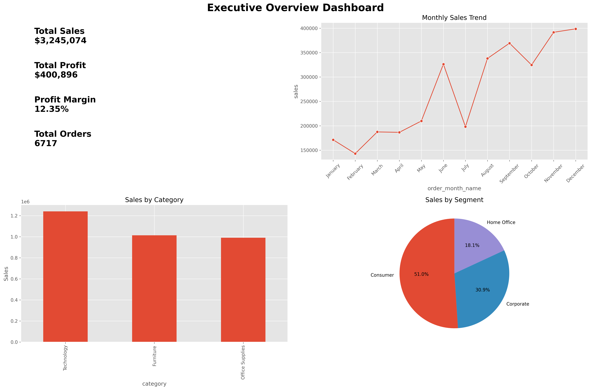
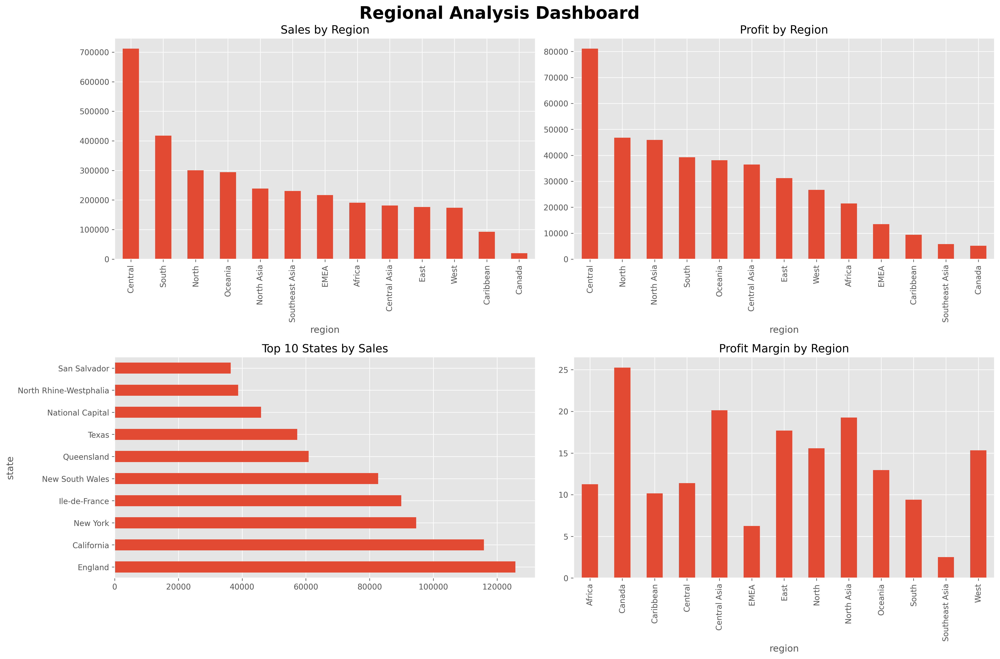
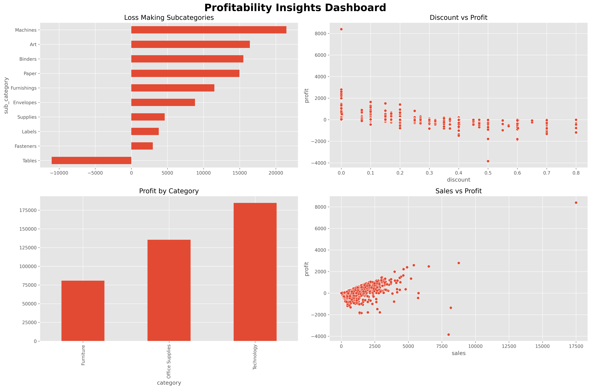

# Sales Performance & Profitability Dashboard

End-to-end business analytics project using SQL, Python, and dashboard reporting to analyze sales performance, profitability trends, customer behavior, and operational insights.

---

# Project Overview

This project simulates a real-world business intelligence workflow by combining:

- SQL for business analysis
- Python for data cleaning and exploratory analysis
- Dashboard reporting for KPI monitoring
- Business storytelling and profitability analysis

The goal of this project is to uncover:
- high-sales but low-profit regions
- operational inefficiencies
- loss-making product categories
- customer segment behavior
- discount impact on profitability

---

# Business Problem

Businesses often generate strong revenue while struggling with profitability across certain regions, products, and customer segments.

This project helps answer important business questions such as:

- Which regions generate high sales but low profit?
- Which product categories are most profitable?
- Which products negatively impact margins?
- How do discounts affect profitability?
- Which customer segments contribute most to revenue?
- What operational improvements can increase profit margins?

---

# Tech Stack

| Category | Tools & Technologies |
|----------|----------------------|
| Programming | Python |
| Data Analysis | Pandas, NumPy |
| Visualization | Matplotlib, Seaborn |
| Querying | SQL |
| Dashboard Reporting | Power BI-style Dashboard Reporting |
| Development Environment | VS Code, Jupyter Notebook |
| Version Control | Git & GitHub |

---

# Project Architecture

```bash
sales-performance-profitability-dashboard/
│
├── README.md
├── requirements.txt
├── .gitignore
│
├── datasets/
│   ├── raw/
│   │   └── superstore_sales.csv
│   │
│   └── cleaned/
│       ├── cleaned_sales_data.csv
│       ├── category_profitability.csv
│       └── regional_profitability.csv
│
├── sql/
│   ├── 01_data_cleaning.sql
│   ├── 02_sales_analysis.sql
│   ├── 03_profitability_analysis.sql
│   ├── 04_kpi_queries.sql
│   └── 05_advanced_business_questions.sql
│
├── python/
│   ├── sales_cleaning.ipynb
│   ├── exploratory_analysis.ipynb
│   ├── profitability_analysis.ipynb
│   └── dashboard_visuals.ipynb
│
├── powerbi/
│   ├── sales_dashboard.pbix
│   ├── README.md
│   ├── business_insights.md
│   │
│   └── dashboard_screenshots/
│       ├── overview.png
│       ├── regional_analysis.png
│       └── profitability.png
│
└── docs/
    ├── data_dictionary.md
    └── project_workflow.md
```

---

# Dataset Information

Dataset Used:
- Superstore Sales Dataset

Dataset contains:
- Orders
- Customers
- Products
- Sales
- Profit
- Discounts
- Shipping Details
- Regional Information

---

# Project Workflow

## 1. Data Collection
Imported retail sales dataset for business analysis.

## 2. Data Cleaning
Performed:
- missing value handling
- datatype conversion
- duplicate removal
- feature engineering
- date transformation

## 3. Exploratory Data Analysis
Analyzed:
- monthly sales trends
- regional performance
- customer segments
- category profitability
- operational patterns

## 4. Profitability Analysis
Investigated:
- low-margin regions
- discount impact
- loss-making products
- category performance

## 5. Dashboard Reporting
Created dashboard visuals for:
- KPI monitoring
- executive reporting
- profitability tracking
- regional comparison

## 6. Business Recommendations
Generated strategic recommendations based on analytical findings.

---

# SQL Analysis

The SQL section includes:

- data cleaning queries
- sales analysis
- profitability analysis
- KPI calculations
- advanced business questions

Key SQL concepts used:
- Joins
- Aggregations
- GROUP BY
- CTEs
- Window Functions
- Business KPI queries

---

# Python Analysis

Python notebooks include:

## sales_cleaning.ipynb
- data preprocessing
- datatype fixing
- feature engineering
- outlier analysis

## exploratory_analysis.ipynb
- sales trends
- regional analysis
- customer segmentation
- category analysis

## profitability_analysis.ipynb
- profit margin analysis
- discount impact
- loss-making products
- business risk analysis

## dashboard_visuals.ipynb
- dashboard image generation
- KPI visual reporting
- business dashboard layouts

---

# Dashboard Screenshots

## Executive Overview



---

## Regional Analysis



---

## Profitability Insights



---

# Key Business Insights

## Regional Imbalance
Certain regions generated strong revenue but relatively weak profitability.

## Discount Impact
Higher discount levels negatively affected profit margins.

## Loss-Making Products
Some sub-categories consistently generated negative profits despite strong sales volume.

## Customer Segment Contribution
Consumer segment contributed the largest percentage of total revenue.

## Seasonal Sales Trends
Monthly sales trends showed fluctuations indicating seasonal demand patterns.

---

# Strategic Recommendations

## Optimize Discount Strategy
Reduce excessive discounting on low-margin products.

## Improve Regional Profitability
Focus on operational efficiency and pricing optimization in weaker regions.

## Inventory Optimization
Increase investment in high-margin product categories.

## Monitor Product Performance
Continuously track loss-making products and adjust pricing strategies.

## KPI Monitoring
Implement continuous dashboard reporting for executive decision-making.

---

# Skills Demonstrated

- SQL Querying
- Data Cleaning
- Exploratory Data Analysis
- Profitability Analysis
- Business Intelligence Reporting
- KPI Reporting
- Dashboard Design
- Business Storytelling
- Data Visualization
- Analytical Thinking

---

# Future Improvements

Potential future enhancements:

- Forecasting models
- Automated ETL pipelines
- Interactive dashboards
- Customer retention analysis
- Advanced analytics workflows

---

# Author

## Dinesh Kumar Gudiputi

- LinkedIn: https://linkedin.com/in/dineshkumargudiputi
- GitHub: https://github.com/dinesh-kumar-gudiputi

---

# Portfolio Project

This project was developed as part of a professional data analytics portfolio focused on:
- business intelligence
- sales analytics
- profitability optimization
- dashboard reporting
- end-to-end analytics workflows